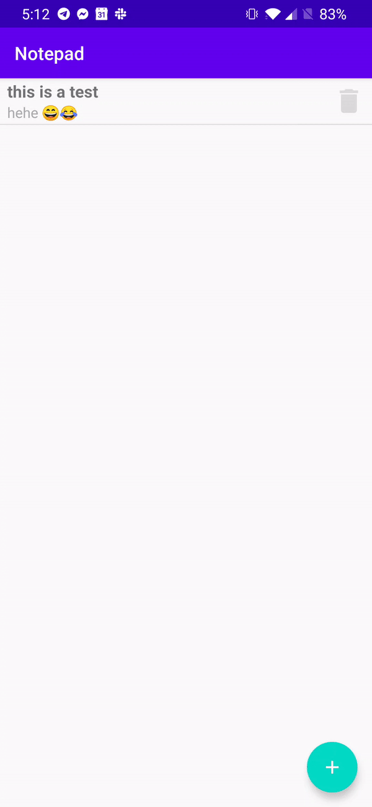

# Notes App

By: Dillion Verma

Notes App is an Android application written in java which allows users to create, read, update and delete (CRUD) their own notes.

## Installation

1. Download and install `app-debug.apk` onto your device.

## Features

- Create notes
- Read notes
- Update notes
- Delete notes
